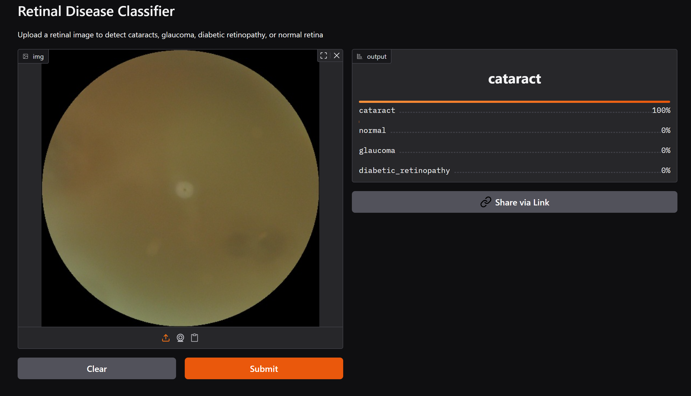

# Retinal Disease Classifier

This project implements a deep learning model for classifying **retinal fundus images** into four categories:  
**Cataract, Diabetic Retinopathy, Glaucoma, and Normal**.

Built using **PyTorch**, **FastAI** with a pretrained **ResNet50** CNN.
This model is deployed as an interactive web app with **Gradio** in Hugging Face Spaces.

---

## Demo

👉 [Try the model live on Hugging Face Spaces](https://huggingface.co/spaces/wujingg/Retina_Disease_Classifier)

Upload a retinal image and receive a disease prediction with confidence scores.

---

## 📊 Model Performance

| Metric     | Value (Validation Set) |
|------------|------------------------|
| Accuracy   | 93%                  |
| Precision  | 93%                  |
| Recall     | 93%                  |
| F1 Score   | 92%                  |

---

## Tech Stack

- Python
- FastAI
- PyTorch
- Gradio

---

